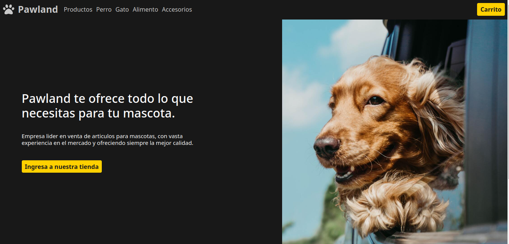

### Ecommerce
## Final Javascript project - Coderhouse

This ecommerce was made with:
 - Vanilla Javascript
 - Toastify JS
 - Node (enviroment)
 - Pure CSS
 - Responsive Design
 - Componentization in Vanilla JS
 
This project gave me a 10 calification in my javascript course in Coderhouse.

[Go to my certification - Spanish](https://www.coderhouse.com/certificados/630291c90b8bf304192cb3ac)

[Go to my certification - English](https://www.coderhouse.com/certificados/630291c90b8bf304192cb3ac?lang=en)
 
